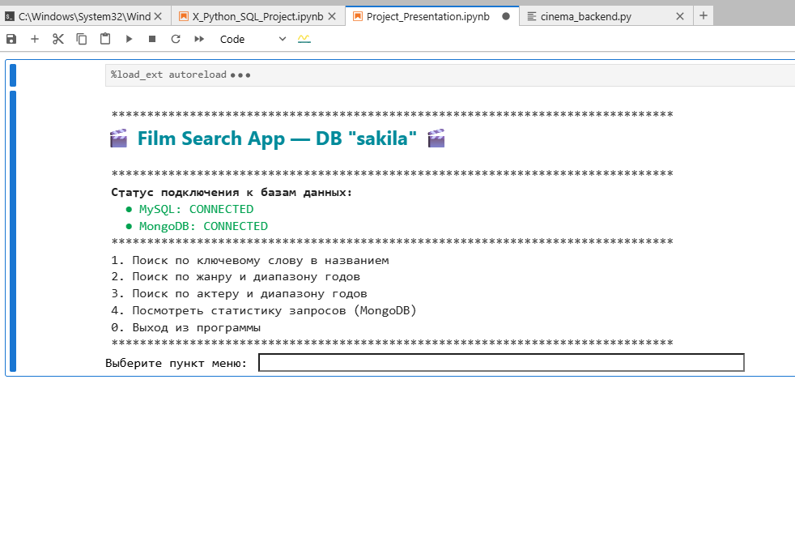
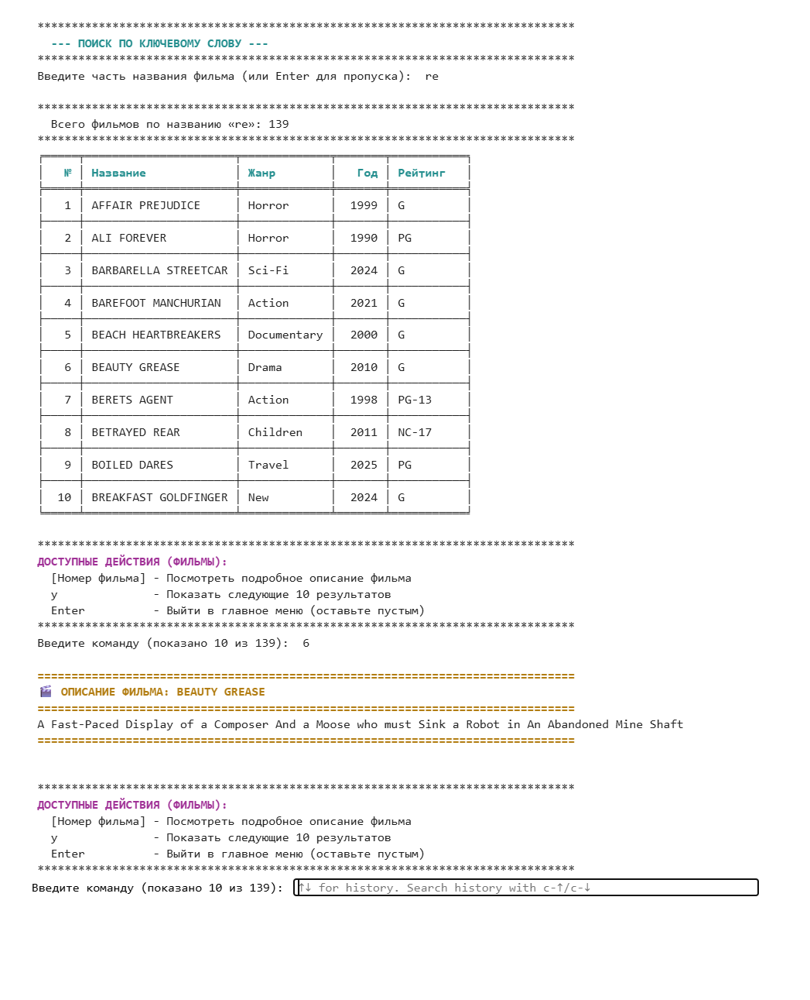
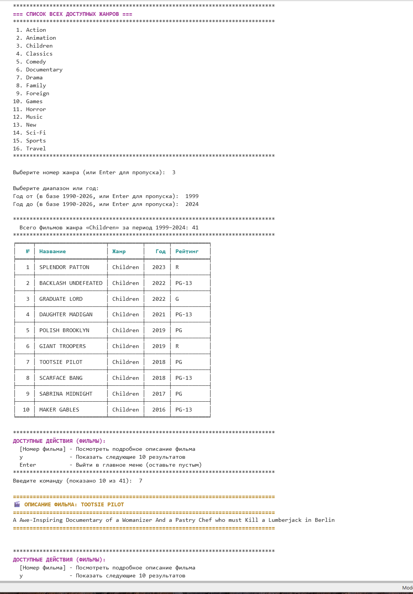
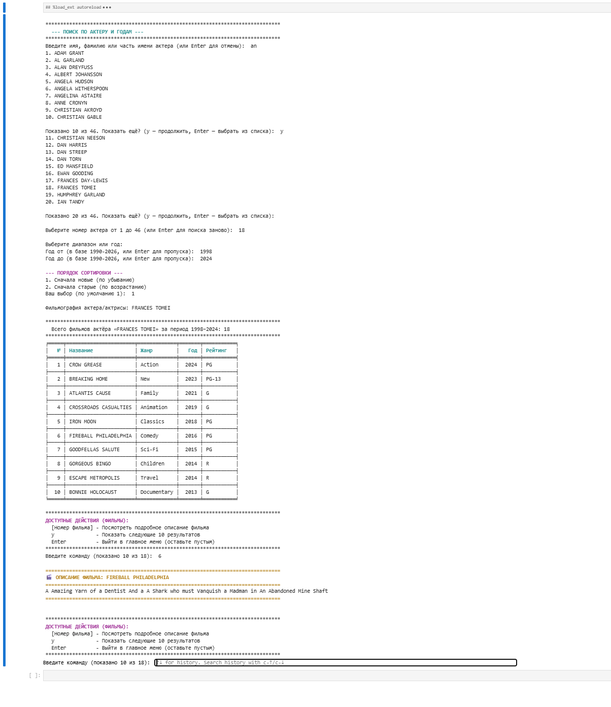
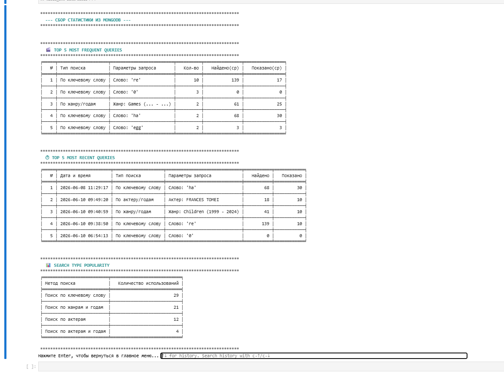

# 🎬 Film Search App — БД "sakila"

Интерактивное консольное приложение для поиска фильмов в базе данных **MySQL Sakila** с логированием запросов в **MongoDB**.

Финальный учебный проект, демонстрирующий чистую архитектуру Python, интеграцию двух баз данных и удобный интерфейс в терминале.

---

## ✨ Возможности

- **Поиск по ключевому слову** — поиск фильмов по части названия, результаты постранично по 10 штук
- **Поиск по жанру и диапазону годов** — перед выбором отображаются все жанры и границы годов в базе
- **Поиск по актёру и диапазону годов** — поиск актёра по части имени, затем фильтрация его фильмографии
- **Карточка фильма** — выберите любой отображённый фильм, чтобы прочитать его описание
- **Логирование запросов в MongoDB** — каждый поиск (включая безрезультатные) сохраняется с временной меткой, параметрами, количеством результатов и просмотренных страниц
- **Статистика** — три табличных отчёта:
  - Топ-5 самых частых запросов
  - Топ-5 последних уникальных запросов
  - Популярность типов поиска
- **Цветной интерфейс в терминале** — ANSI-раскраска и индикаторы подключения к БД при старте

---

## 🗂️ Структура проекта

```
cinema_backend.py          # Один файл приложения (совместим с Jupyter Notebook)
│
├── Style                  # Константы ANSI-цветов и стилей (класс)
│
├── Блок 1 — Подключение к MySQL
│   ├── config             # Параметры подключения
│   └── test_mysql_connection()
│
├── Блок 2 — Функции поиска (MySQL)
│   ├── Вспомогательные функции
│   │   ├── get_all_genres()
│   │   ├── get_min_max_years()
│   │   ├── get_year_range_input()     # со вложенной _ask_year()
│   │   ├── get_actors_by_keyword()
│   │   ├── get_search_inputs()        # единый сборщик параметров ввода
│   │   ├── build_search_summary()
│   │   ├── paginate_results()
│   │   ├── paginate_actors()
│   │   ├── build_sql_filters()        # универсальный сборщик WHERE
│   │   ├── get_sort_direction()
│   │   └── select_film_from_list()
│   │
│   └── Основные функции поиска
│       ├── search_film_by_keyword()
│       ├── search_film_by_genre_and_years()
│       ├── search_film_by_actor_and_year()
│       ├── get_film_description()
│       └── display_results()
│
├── Блок 3 — Подключение к MongoDB
│   ├── MONGO_CONFIG / COLLECTION_NAME
│   ├── get_mongo_client()
│   └── test_mongo_connection()
│
├── Блок 4 — Логирование и аналитика (MongoDB)
│   ├── log_query()
│   ├── get_top_queries()
│   ├── get_recent_queries()
│   └── get_search_type_popularity()
│
├── Блок 5 — Отображение статистики (Tabulate)
│   ├── _format_params()
│   ├── _TYPE_LABELS
│   ├── _show_top_queries()
│   ├── _show_recent_queries()
│   ├── _show_type_popularity()
│   └── display_stats()
│
└── Блок 6 — Главное меню
    └── main_menu()
```

---

## 🛠️ Технологии

| Компонент         | Технология          |
|-------------------|---------------------|
| Язык              | Python 3.x          |
| Данные о фильмах  | MySQL (Sakila DB)   |
| Логи запросов     | MongoDB             |
| Драйвер MySQL     | `pymysql`           |
| Драйвер MongoDB   | `pymongo`           |
| Вывод таблиц      | `tabulate`          |
| Интерфейс ноутбука| `IPython.display`   |

---

## ⚙️ Установка

1. **Клонируйте репозиторий:**
   ```bash
   git clone https://github.com/your-username/film-search-app.git
   cd film-search-app
   ```

2. **Установите зависимости:**
   ```bash
   pip install pymysql pymongo tabulate ipython
   ```

3. **Настройте параметры подключения** в файле `cinema_backend.py`:

   ```python
   # MySQL — Блок 1
   config = {
       "host": "адрес-вашего-mysql",
       "user": "пользователь",
       "password": "пароль",
       "database": "sakila",
       ...
   }

   # MongoDB — Блок 3
   MONGO_CONFIG = {
       "host": "адрес-вашего-mongo",
       "username": "пользователь",
       "password": "пароль",
       "authSource": "база-аутентификации",
   }
   MONGO_DB_NAME = "имя_базы"
   COLLECTION_NAME = "имя_коллекции"
   ```

---

## ▶️ Запуск

**В Jupyter Notebook** (рекомендуется — используется `IPython.display` для заголовка и `clear_output` для очистки экрана):

Откройте `cinema_backend.py` или вставьте код в ячейку ноутбука и запустите последнюю ячейку:
```python
main_menu()
```

**Как обычный Python-скрипт:**
```bash
python cinema_backend.py
```
> Примечание: `clear_output()` не работает вне Jupyter, но приложение запустится корректно.

---

## 🗄️ Формат лога MongoDB

Каждый поисковый запрос сохраняется в следующем формате:

```json
{
  "timestamp": "2025-05-01T15:34:00+00:00",
  "search_type": "keyword",
  "params": {
    "keyword": "matrix"
  },
  "results_count": 3,
  "total_viewed": 3
}
```

Возможные значения `search_type`: `keyword`, `genres-years`, `actor`, `actor-years`.

---

## 📊 Статистика

Доступна из главного меню → пункт **4**. Выводит три отчёта:

- **Топ-5 самых частых запросов** — сгруппировано по типу и параметрам, со средними значениями найденных и просмотренных результатов
- **Топ-5 последних уникальных запросов** — последние поиски с временными метками
- **Популярность типов поиска** — общее количество использований каждого метода

---

## 🧱 Архитектурные решения

**Почему функции, а не классы для логики поиска?**
Каждая операция поиска — это самостоятельный поток: сбор ввода → запрос в БД → пагинация → логирование. Использование обычных функций делает каждый шаг наглядным и простым для тестирования. Класс добавил бы структуру без реальной пользы.

**Почему универсальный сборщик `build_sql_filters()`?**
Все три типа поиска используют одни и те же параметры фильтрации (жанр, год_от, год_до, actor_id, ключевое_слово). Централизация генерации WHERE-условий устраняет дублирование и делает добавление новых фильтров изменением в одном месте.

**Почему логируются даже пустые результаты?**
Аналитика должна отражать реальное поведение пользователей, включая безуспешные поиски. Логи пустых запросов помогают выявить пробелы в базе данных или недостатки интерфейса.

---

## 📸 Демо

### Главное меню


### Результаты поиска




### Статистика запросов


---

## 📋 Требования

- Python 3.8+
- Доступ к серверу MySQL с [учебной базой Sakila](https://dev.mysql.com/doc/sakila/en/)
- Доступ к экземпляру MongoDB

---

## 👩‍💻 Автор

**Коньюченко Анна**  
Финальный проект — IT Career Hub, Группа 051225
